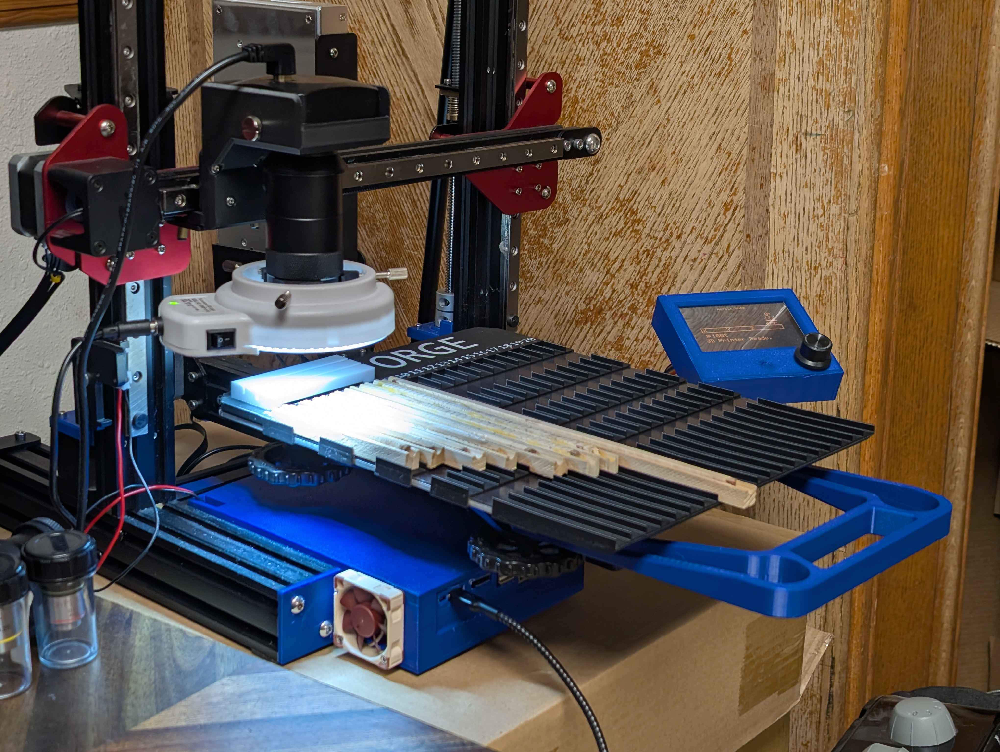
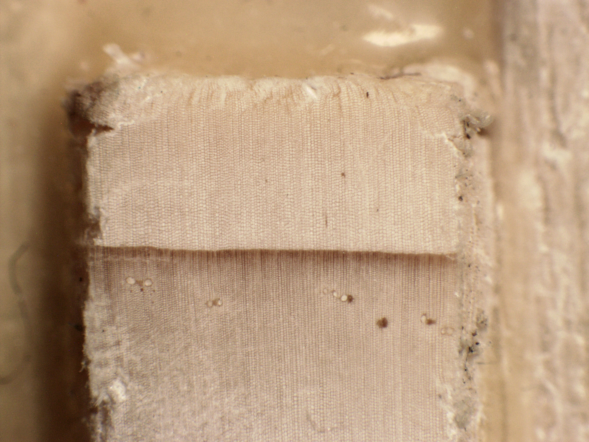
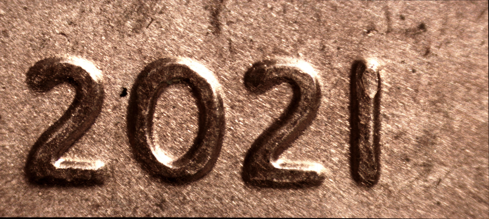
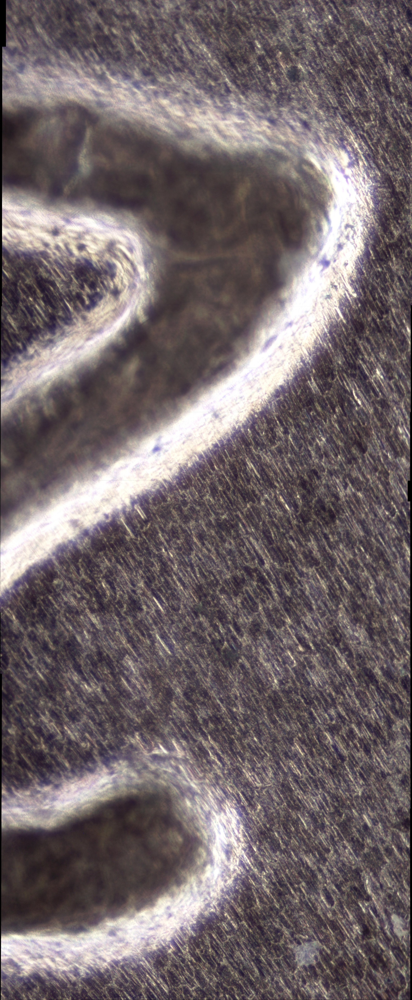

# Forge - Low Cost Gigapixel Scanner

[](#)
[](#)


Forge is an opensource, gigapixel imaging system designed to scan tree core samples with high precision. Built upon a modified off the shelf 3D printer, it automates the imaging of multiple samples, producing high resolution images suitable for dendrochronology and related research. 


## Features

* **Automated Scanning**: Utilizes 3D printer mechanics for precise, repeatable sample movement.
* **High-Resolution Imaging**: Captures gigapixel images of tree core samples.
* **Image Processing**: Includes tools for stitching captured images.
* **Modular Design**: Easily adaptable to different sample types and imaging requirements.


## Examples

<table>
  <tr>
    <td width="37%">
      <a href="media/DeveloperForge.jpg">
        
      </a>
    </td>
    <td width="50%">
      <a href="media/GUI.png">
        
      </a>
    </td>
  </tr>
	<tr>
    <th>Forge on a heavily modded Ender 3 3D printer.</th>
    <th>Forge's GUI</th>
	</tr>
  <tr>
    <td width="37%">
      <a href="media/WoodExample.jpg">
        
      </a>
    </td>
    <td width="50%">
      <a href="media/M2HeatsetInsert.jpeg">
        
      </a>
    </td>
  </tr>
	<tr>
    <th>The end of a tree core sample taken using a MU1000 HS camera</th>
    <th>A M2 Heatset Insert Tip taken using a MU500 Camera. Typical Forge outputs for tree core samples are significantly larger. Click to view full resolution</th>
	</tr>
</table>

## Forge for Reflected Light Microscopy
> **Reflected Light Microscopy (alternate lens configuration)**  
   These images were captured using Forge with a different lens and illumination setup. The same capture pipeline was used, with image stacking and stitching currently performed using external tools.  
   Forge does not officially support high magnification imaging yet, but it is being worked on. See github issue [#45](https://github.com/AnthonyvW/FORGE/issues/45)
<table>
  <tr>
    <td width="50%">
      <a href="media/penny.jpg">
        
      </a>
    </td>
    <td width="20%">
      <a href="media/Dust.png">
        
      </a>
    </td>
    <td width="14%">
      <a href="media/2Penny.jpg">
        
      </a>
    </td>
  </tr>
	<tr>
		<th>A series of stitched images covering the date on a penny taken at 5x magnification</th>
    <th>Stiched section of a tree core taken using an experimental lens setup</th>
    <th>The 2 on a penny at 10x magnification</th>
	</tr>
</table>
<table>
  <tr>
    <td width="50%">
      <a href="media/TreeCoreMagnified.jpg">
        
      </a>
    </td>
  </tr>
	<tr>
		<th>A series of stitched images covering the full width of a tree core sample taken at 10x magnification. Click to view full resolution.</th>
	</tr>
</table>

## Getting Started

### Prerequisites

* **Hardware**: A [compatible 3D printer](#3d-printer-compatibility) modified for imaging purposes, a light, and a [compatible camera](#confirmed-compatible-cameras). The 3D printer may also require an additional cable to connect your PC to the printer.
  * For the light I recommend using the [Amscope 144 led ring light](https://www.amazon.com/dp/B00JZJO7YC). If you use this, make sure to 3D print the light pads to prevent scratching the lens.
  * If using an Amscope camera, I highly recommend using this ([100x Microscope Lens for Raspberry Pi](https://www.amazon.com/100X-Microscope-Lens-Magnification-Compatible/dp/B0C1CC79TX)) industrial lens as it provides minimal distortion around the edges.
  * Not required, but is recommended is a thumbscrew for holding the camera in place. I use thumbscrews from [this 16 piece set](https://www.amazon.com/dp/B0DQPM68KJ) from Amazon.
* **Software**: Python 3.x and Git
* **Operating System**: Linux, Windows 10, or Windows 11

## Printer Modification

Before using Forge, your 3D printer must be modified to mount the camera system in place of the print head.

### Required Printed Parts

Before modifying your printer, you must 3D print the following components:

- **Camera Mount** - Ender 3 Camera Mount.3mf – Attaches to the existing print head carriage  
- **Z-Axis Spacer** - ZAxisSpacer.3mf – Raises the Z-axis endstop to accommodate the new camera height  
    - If you are proficient with working with electronics, I suggest replacing the Z axis end stop wires with longer ones instead and mounting the Z axis limit switch higher.
- **Sample Clips** – Secure core samples to the print bed without manual alignment
    - SampleHolderEnd.3mf
    - SampleHolderFooter.3mf
    - SampleHolderMiddle.3mf - You will need 3 of these. I suggest printing one of these off and ensuring that it properly fits before printing off the rest of the parts.

> files for these parts will be provided in the `hardware/` folder of this repository.

---

### Modification Instructions

> ! IMPORTANT ! Ensure that you have all 3D printed parts before modifying your 3D printer.

1. **Unplug 3D Printer**  
   Ensure the 3D printer is disconnected from power before working on it.

2. **Remove the Print Head**  
   Unscrew and detach the printer's hotend from the X-axis print carriage.

3. **Disconnect Wiring**  
   Carefully disconnect the hotend and heatbed wiring from the printer's control board. This prevents accidental heating or movement of the removed components.

4. **Install Camera Mount**  
   Use the print head screws to attach the printed camera mount to the same location on the print carriage where the print head was originally mounted.

5. **Insert Z-Axis Spacer**  
   Add the printed Z-axis spacer on the Z endstop, so the camera does not crash while homing.

6. **Install Camera and Lens**  
   - Insert your digital microscope or Amscope camera into the printed mount.  
   - Screw on the imaging lens securely.  
   
7. **Install Light**  
   Install the light you will be using with Forge. 
   > If using the Amscope ring light, place the light pads onto the metal tips of the screws that hold the light in place before putting the light on the lens.

8. **Plug Everything in**  
   - Plug the 3D printer back into the wall
   - Plug the 3D printer into your computer via USB for motion control.  
   - Plug in the camera using its USB interface for image capture.
   - Plug in the Light

9. **Done**

### Installation

Prerequisites\. Ensure you have the latest version of python installed, and you have git installed.

> Python : https://www.python.org/downloads/  
> Git : https://git-scm.com/downloads

1\. Clone the repository:

   ```bash
   git clone https://github.com/AnthonyvW/FORGE.git
   cd FORGE
   ```


2\. Install the required Python packages:

  ```bash
  pip install -r requirements.txt
  ```

3\.1\. Download the Amscope SDK for your camera at https://amscope.com/pages/software-downloads if you are on mac or linux, download the windows version as it includes the files for those operating systems there.

3\.2\. Move the downloaded zipped folder into 3rd_party_imports

4\. Configure the camera settings using `amscope_camera_configuration.yaml`. For now, you can copy settings from TRIM until I get around to properly implementing this functionality into Forge.

5\. Run the main application:
  
  ```bash
  python main.py
  ```

---
## Confirmed Compatible Cameras
Forge supports USB cameras through a modular driver architecture.

| Camera Model            | Notes                       |
|-------------------------|-----------------------------|
| Amscope MU500           | Fully tested and supported  |
| Amscope MU1000          | Fully tested and supported  |
| Amscope MU1000 HS       | Fully tested and supported  |

⚠️ Amscope's SDK for the MU1000 HS is currently out of date as of 1/6/2026, but according to support should be updated in a few days.

> Support for generic USB cameras is planned, but not yet implemented

### Adding Support for New Cameras

Users are encouraged to contribute new camera interfaces by implementing the Forge camera interface and submitting them as pull requests.

If your camera is not currently supported or you would like to contribute an interfaces, please open an issue or submit a pull request.

Due to the complexity of hardware integration—especially with cameras requiring proprietary APIs or SDKs full support often requires physical access to the device for development and testing. If you would like me to implement support for your camera, please be prepared to ship the device or provide access to equivalent hardware.

Alternatively, contributions of driver implementations with thorough documentation and test instructions are highly appreciated.


## 3D Printer Compatibility

Forge is designed to run on 3D printers using **Marlin firmware**, which supports standard G-code over USB serial. Compatibility with other firmware types varies and may require additional configuration or is not currently supported.

> Not sure if your 3D printer will work? Plug your printer into your computer via USB, and then start Forge. If the printer homes then it is compatible with Forge.

## Confirmed Compatible Printers

| Printer Model           | Firmware | Build Volume (mm) | Notes                                                  |
|-------------------------|----------|-------------------|--------------------------------------------------------|
| Ender 3 v1              | Marlin   | 220 × 220 × 250   | Fully tested and supported. It is highly recommended that you use the official linear rail upgrade kit provided by Creality for the increased camera stability.                             |
| Creality CR-10S Pro v2  | Marlin   | 300 × 300 × 400   | Fully tested; camera mount file not available.          |
| Anycubic Kobra Max v1      | Marlin   | 400 × 400 × 450   | Fully tested; camera mount file not available.          |
---

## ⚠️ Incompatible or Unverified Setups

| Printer / Firmware                | Status        | Reason                                                                 |
|----------------------------------|---------------|------------------------------------------------------------------------|
| **Klipper-based printers**       | ❓ Unverified  | Serial responses (e.g., `ok`, `M400`) may differ. Needs testing.       |
| **RepRapFirmware (e.g., Duet)**  | ❌ Incompatible | Different G-code syntax; not supported by Forge                        |
| **Sailfish Firmware (e.g., FlashForge)** | ❌ Incompatible | Proprietary, non-standard G-code                                       |
| **Proprietary OEM firmware**     | ❌ Incompatible | Often locked or limited (e.g., XYZprinting); lacks serial G-code input |
| **Non-G-code motion platforms**  | ❌ Incompatible | Forge requires G-code over USB for motion control                      |

> Want to help verify compatibility with other printers, firmware, or cameras?  
> [Open an issue](https://github.com/AnthonyvW/FORGE/issues) with your setup details and test results!

### ❌ Confirmed Incompatible Printers

| Printer Model           | Firmware | Build Volume (mm) | Notes                                                    |
|-------------------------|----------|-------------------|----------------------------------------------------------|
| Bambulab A1             | Marlin   | 220 × 220 × 250   | Properietary Firmware, cannot send gcode directly to it  |
| Anycubic Kobra Max 3    | Klipper  | 400 × 400 × 450   | Uses Klipper                                             |

---

## Contributing

Contributions are welcome! Please fork the repository and submit a pull request with your enhancements. For major changes, open an issue first to discuss your proposed modifications.

## Troubleshooting

**Camera freezes when taking pictures**
- Sometimes the serial drivers conflict with the camera drivers, to fix this, plug in the camera and the 3D printer into two different sides of the computer. This forces them to be on different usb controllers which fixes any conflicts they might have.
