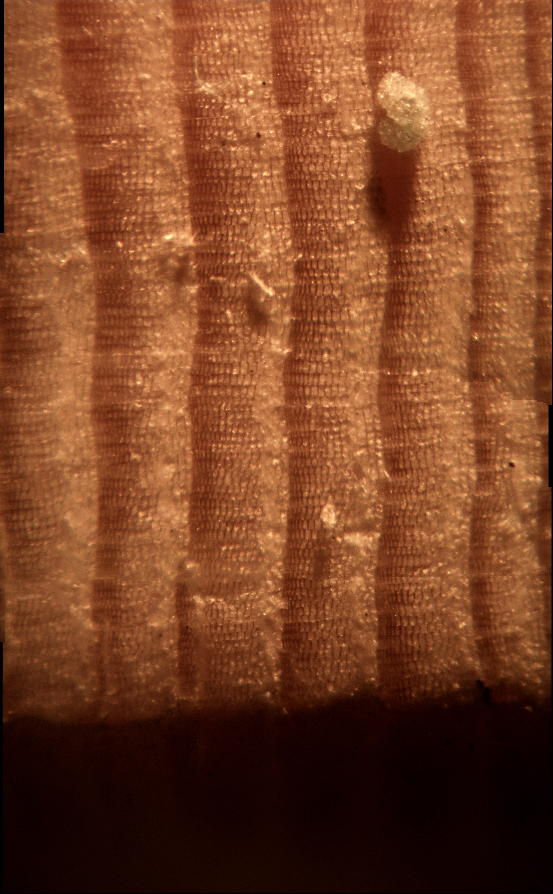

# Forge - Low Cost Gigapixel Scanner

[](#)
[](#)


Forge is an open-source, gigapixel-scale imaging system designed to scan tree core samples with high precision. Built upon a modified off-the-shelf 3D printer, it automates the imaging of multiple samples, producing ultra-high-resolution images suitable for dendrochronology and related research. 

<table>
  <tr>
    <td width="19%">
      <a href="media/Dust.jpg">
        
      </a>
    </td>
    <td width="50%">
      <a href="media/GUI.png">
        
      </a>
    </td>
  </tr>
</table>


> *Above: A stitched image covering a 1.5mm x 3mm area of a tree core sample and one showing Forge's GUI. The stitched image was taken using a 0.5x lens and a 10x lens with a custom lens mount on Forge and then focused stacked and stiched together to create the image. Click to view full resolution.*

---

## Features

* **Automated Scanning**: Utilizes 3D printer mechanics for precise, repeatable sample movement.
* **High-Resolution Imaging**: Captures gigapixel images of tree core samples.
* **Image Processing**: Includes tools for stitching captured images.
* **Modular Design**: Easily adaptable to different sample types and imaging requirements.

---

## Getting Started

### Prerequisites

* **Hardware**: A [compatible 3D printer](#3d-printer-compatibility) modified for imaging purposes, a light, and an amscope camera. The 3D printer may also require an additional cable to connect your PC to the printer.
* **Software**: Python 3.x and Git
* **Operating System**: Linux, Windows 10, or Windows 11

## Printer Modification

Before using Forge, your 3D printer must be modified to mount the camera system in place of the print head.

### Required Printed Parts

Before modifying your printer, you must 3D print the following components:

- **Camera Mount** - Ender3AmscopeCameraMount.3mf – Attaches to the existing print head carriage  
- **Z-Axis Spacer** - ZAxisSpacer.3mf – Raises the Z-axis endstop to accommodate the new camera height  
- **Sample Clips** – Secure core samples to the print bed without manual alignment
    - SampleHolderEnd.3mf
    - SampleHolderFooter.3mf
    - SampleHolderMiddle.3mf - You will need 3 of these. I suggest printing one of these off and ensuring that it properly fits before printing off the rest of the parts.

> files for these parts will be provided in the `hardware/` folder of this repository.

---

### Modification Instructions

> ! IMPORTANT ! Ensure that you have all 3D printed parts before modifying your 3D printer.

1. **Remove the Print Head**  
   Unscrew and detach the printer's hotend from the X-axis print carriage.

2. **Disconnect Wiring**  
   Carefully disconnect the hotend and heatbed wiring from the printer's control board. This prevents accidental heating or movement of the removed components.

3. **Install Camera Mount**  
   Use the print head screws to attach the printed camera mount to the same location on the print carriage where the print head was originally mounted.

4. **Insert Z-Axis Spacer**  
   Add the printed Z-axis spacer on the Z endstop, so the camera does not crash while homing.

5. **Install Camera and Lens**  
   - Insert your digital microscope or Amscope camera into the printed mount.  
   - Screw on the imaging lens securely.  
   
6. **Install Light**  
   Install the light you will be using with Forge

7. **Connect to Computer**  
   Plug the 3D printer into your computer via USB for motion control.  
   Then plug in the camera using its USB interface for image capture.

### Installation

Prerequisites\. Ensure you have the latest version of python installed, and you have git installed.

> Python : https://www.python.org/downloads/  
> Git : https://git-scm.com/downloads

1\. Clone the repository:

   ```bash
   git clone https://github.com/AnthonyvW/FORGE.git
   cd FORGE
   ```


2\. Install the required Python packages:

  ```bash
  pip install -r requirements.txt
  ```

3\.1\. Download and Install the Amscope SDK at https://amscope.com/pages/software-downloads if you are on mac or linux, download the windows version as it includes the files for those operating systems there.

3\.2\. Move the zipped folder into 3rd_party_imports

4\. Configure the camera settings using `amscope_camera_configuration.yaml`. For now, you can copy settings from TRIM until I get around to properly implementing this functionality into Forge.

5\. Run the main application:
  
  ```bash
  python main.py
  ```

---
### ✅ Confirmed Compatible Cameras
Forge supports USB cameras through a modular driver architecture.

| Camera Model            | Notes                       |
|-------------------------|-----------------------------|
| Amscope MU500           | Fully tested and supported  |
| Amscope MU1000          | Fully tested and supported  |
| Amscope MU1000 HS       | Fully tested and supported  |

⚠️ Amscope's SDK is currently out of date as of 9/16/2025, but according to support should be updated in a few weeks.

> Support for generic USB cameras, and raspberry pi HQ cameras is planned, but not yet implemented

### Adding Support for New Cameras

Users are encouraged to contribute new camera drivers by implementing the Forge camera interface and submitting them as plugins or pull requests.

If your camera is not currently supported or you would like to contribute a driver, please open an issue or submit a pull request.

Due to the complexity of hardware integration—especially with cameras requiring proprietary APIs or SDKs—full support often requires physical access to the device for development and testing. If you would like me to implement support for your camera, please be prepared to ship the device or provide access to equivalent hardware.

Alternatively, contributions of driver implementations with thorough documentation and test instructions are highly appreciated.


## 3D Printer Compatibility

Forge is designed to run on 3D printers using **Marlin firmware**, which supports standard G-code over USB serial. Compatibility with other firmware types varies and may require additional configuration or is not currently supported.

> ⚠️ **Important: Only bed slinger printers are supported.**  
> Forge requires the camera to be mounted in place of the print head. This setup depends on the printer moving the **bed (Y-axis)** rather than the toolhead, which is standard in bed slinger designs. CoreXY and other stationary-bed printers are **not currently supported**.

### ✅ Confirmed Compatible Printers

| Printer Model           | Firmware | Build Volume (mm) | Notes                                                  |
|-------------------------|----------|-------------------|--------------------------------------------------------|
| Ender 3 v1              | Marlin   | 220 × 220 × 250   | Fully tested and supported                             |
| Creality CR-10S Pro v2  | Marlin   | 300 × 300 × 400   | Fully tested; camera mount file not available          |
| Anycubic Kobra Max      | Marlin   | 400 × 400 × 450   | Fully tested; camera mount file not available. Note that this is for the V1 version and not the new V3 version.          |
---

### ⚠️ Incompatible or Unverified Setups

| Printer / Firmware                | Status        | Reason                                                                 |
|----------------------------------|---------------|------------------------------------------------------------------------|
| **Klipper-based printers**       | ❓ Unverified  | Serial responses (e.g., `ok`, `M400`) may differ. Needs testing.       |
| **RepRapFirmware (e.g., Duet)**  | ❌ Incompatible | Different G-code syntax; not supported by Forge                        |
| **Sailfish Firmware (e.g., FlashForge)** | ❌ Incompatible | Proprietary, non-standard G-code                                       |
| **Proprietary OEM firmware**     | ❌ Incompatible | Often locked or limited (e.g., XYZprinting); lacks serial G-code input |
| **Non-G-code motion platforms**  | ❌ Incompatible | Forge requires G-code over USB for motion control                      |

> Want to help verify compatibility with other printers, firmware, or cameras?  
> [Open an issue](https://github.com/AnthonyvW/FORGE/issues) with your setup details and test results!

### ❌ Confirmed Incompatible Printers

| Printer Model           | Firmware | Build Volume (mm) | Notes                                                    |
|-------------------------|----------|-------------------|----------------------------------------------------------|
| Bambulab A1             | Marlin   | 220 × 220 × 250   | Properietary Firmware, cannot send gcode directly to it  |
| Anycubic Kobra Max 3    | Klipper  | 400 × 400 × 450   | Uses Klipper                                             |

---

## Contributing

Contributions are welcome! Please fork the repository and submit a pull request with your enhancements. For major changes, open an issue first to discuss your proposed modifications.
